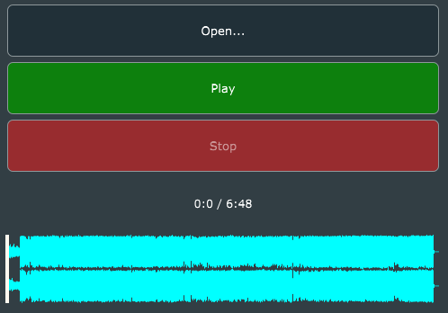

# Description

A simple sound file player based on [this](https://docs.juce.com/master/tutorial_playing_sound_files.html) JUCE tutorial.

# Build
At the moment, the application should be built using the [Projucer](https://juce.com/discover/projucer).